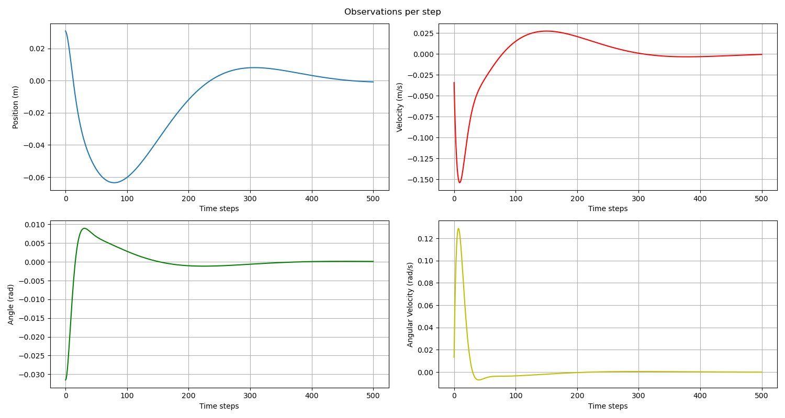
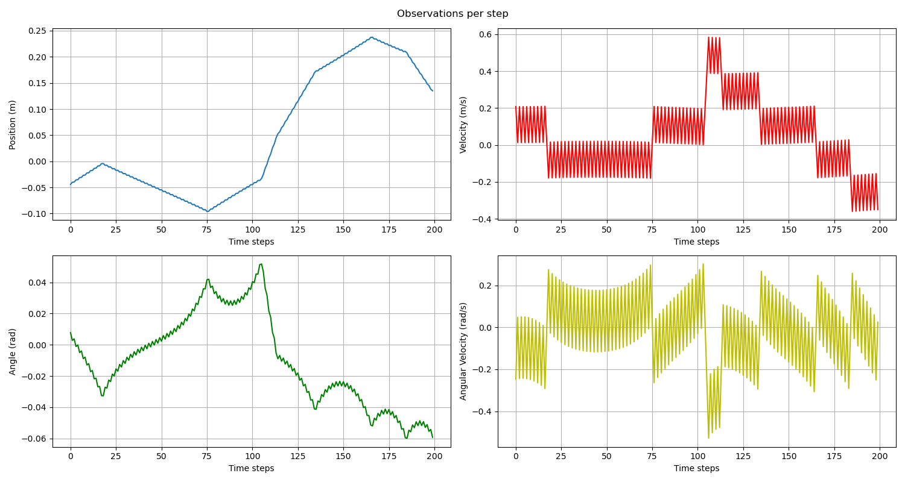
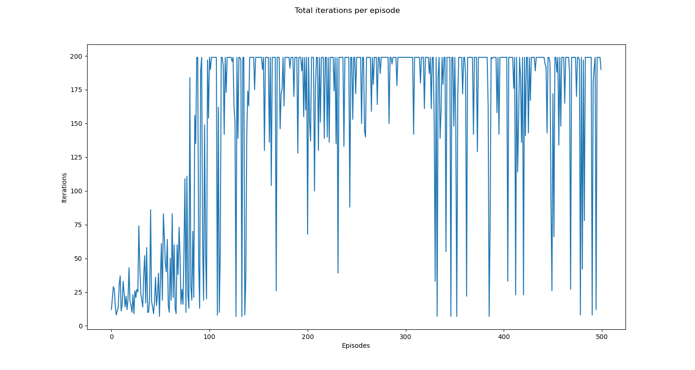

# Agent versus Controller approach in balancing CartPole system.
---
Project inspired by [Optimal Control with OpenAI Gym](https://towardsdatascience.com/comparing-optimal-control-and-reinforcement-learning-using-the-cart-pole-swing-up-openai-gym-772636bc48f4) and [Using Q-Learning to solve the CartPole balancing problem](https://medium.com/@flomay/using-q-learning-to-solve-the-cartpole-balancing-problem-c0a7f47d3f9d) articles.

In this project two different approaches of the famous cart pole balancing problem are investigated. The first utilizes the classic Control Theory, with a State Feedback Controller while the second one utilizes a Q-learning ε-greedy Reinforcement Learning approach. The main difference of the two approaches is that in Control Theory we assume that the underlying system dynamics are known in advance, while in Reinforcement Learning the agent either learns a model of the system dynamics (model-based reinforcement learning) or tries to solve a task without a model (model-free reinforcement learning).

The [CartPole-v1](https://gym.openai.com/envs/CartPole-v1/) environment from OpenAI Gym was used for the experiments that took place.

---
### The State Feedback Controller approach 

The control mechanism utilizes a Linear Quadratic Regulator (LQR) for the cost function minimization:

The system is described by the following equation:

or

LQR tries to find an optimal control matrix K by minimizing the cost function:

the feedback control law that minimizes the cost function is:

where K is given by 

 

and P is found by solving the continuous time Riccati differential equation:

#### Results produced at one of the experiments
#### Cart position and velocity along with pole angle and angular velocity figures in each time step are presented below:

---
### The Q-learning ε-greedy approach

Q-learning is a Reinforcement Learning algorithm that relies on an agent updating its action-value pair functions towards maximizing its rewards. A principal property of Q-learning algorithm is off-policy learning where it converges to an optimal policy even when acting suboptimally. In this experiment the ε-greedy policy was used, where the agent, instead of acting greedily, selects randomly with a small probability ε one of the available actions and not the one with max reward.

In the implemented approach, epsilon value was set to 1 (higher exploration) and got reduced by 0.01 per episode until reaching 0.01 (higher exploitation). 

- #### Results produced at one of the experiments (ε-greedy approach doesn't always produce same results)
#### Cart position and velocity along with pole angle and angular velocity figures in each time step are presented below:

#### Total iterations (balance pole without exceeding threshold) per episode are shown at the figure below:

---
##### You can clone the project from repository using the following command:

    git clone https://github.com/JoKoum/reinforcement-learning-vs-control-theory.git
     
##### You can create a new virtual environment and install the dependencies using the requirements.txt file:
On macOS and Linux:

    python3 -m venv <env>

On Windows:

    py - m venv <env>

Package installation using requirements.txt file:

    pip install -r requirements.txt

##### more info in [pip and virtual environments](https://packaging.python.org/guides/installing-using-pip-and-virtual-environments/)
